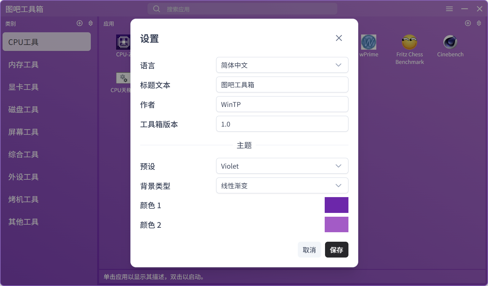

# Rapid Toolbox

[简体中文](README_zh-CN.md)

A portable app launcher for organizing and accessing your collection of apps, built using [Tauri](https://tauri.app/) and [Vue.js](https://vuejs.org/). [PrimeVue](https://primevue.org/) is also used for UI components.

## Features

- Add executable files to the app library
- Organize apps by categories
- Search for apps on the fly
- Change the order of apps and categories by drag and drop or using sort function
- Set app icon to the built-in icon of the app or the icon of your choice
- Customizable title text
- Customizable theme colors

## Screenshots

