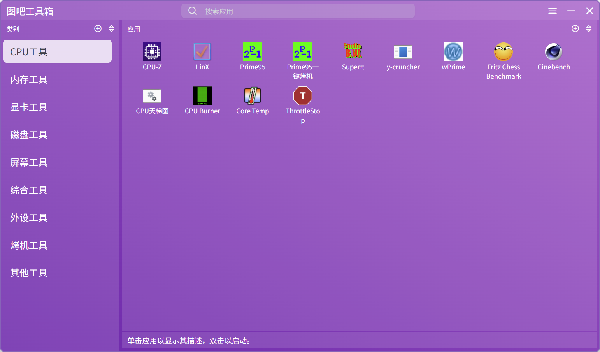
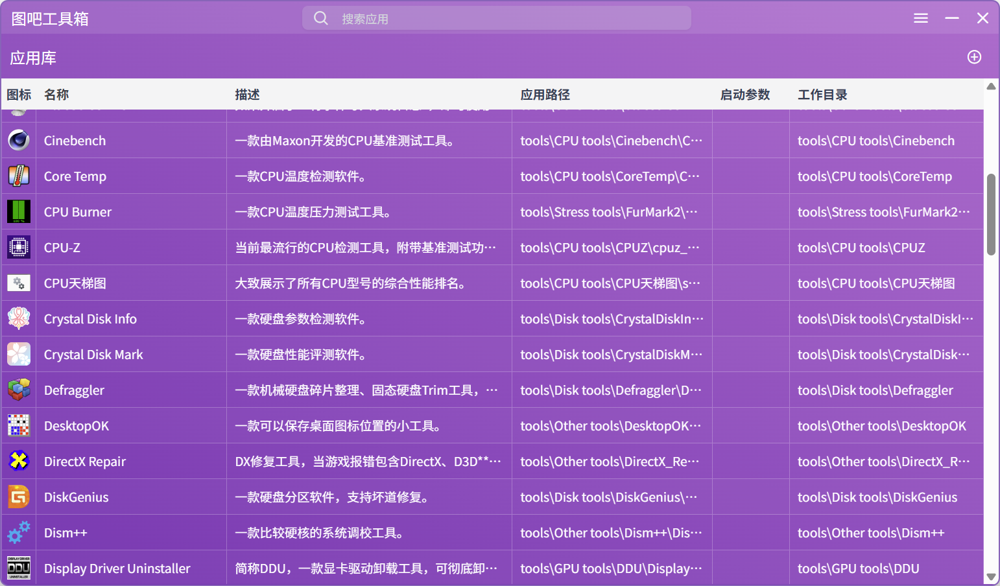
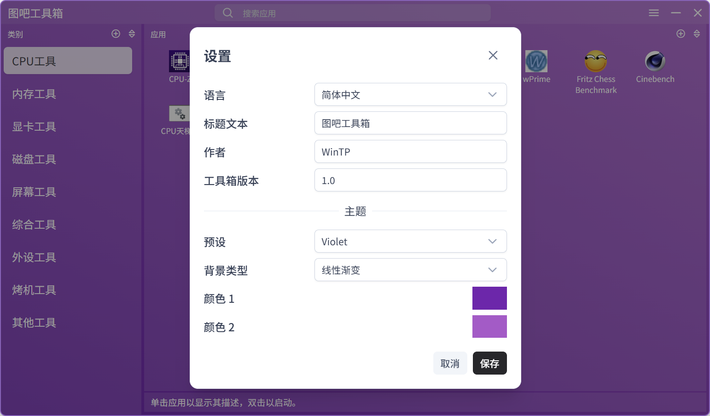

# Rapid Toolbox

[English](README.md)

一款便携的应用启动器，用来组织并访问你的应用集合，其使用 [Tauri](https://tauri.app/) 和 [Vue.js](https://vuejs.org/) 搭建而成，还用到了 [PrimeVue](https://primevue.org/) 的 UI 组件。

## 功能

- 将可执行文件添加到应用库
- 按类别组织应用
- 随时能搜索应用
- 使用拖放或者排序功能来调整应用和类别的顺序
- 应用图标可设置为应用内置图标或者你所选择的图标
- 可自定义的标题文本
- 可自定义的主题颜色

## 屏幕截图

